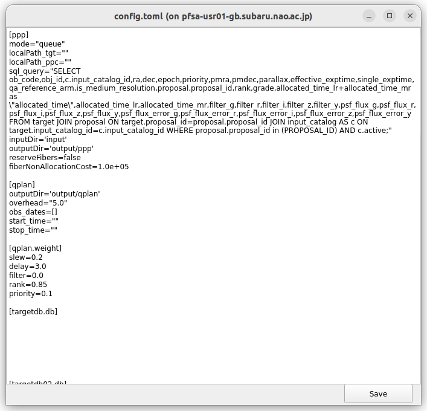
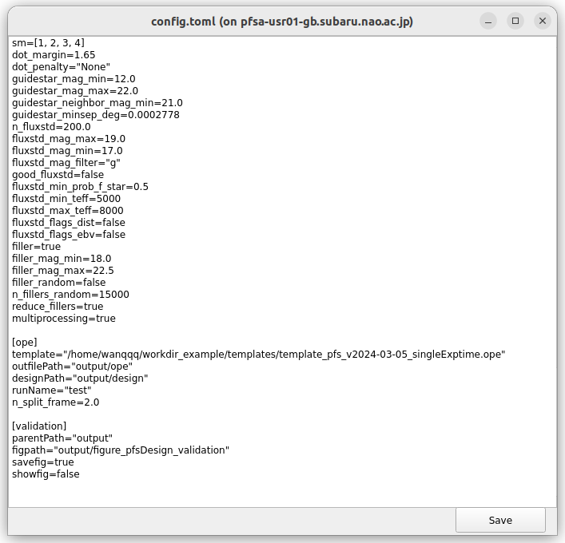

# Tutorial on using the GUI of integrated codes

## Pre-requirements

- Please refer to [README](../README.md) for installation 
    - Please clone the branch `u/wanqqq/update_2024aug` instead of `main` for now (Oct. 2024)
        ```shell
        git clone -b u/wanqqq/update_2024aug https://github.com/Subaru-PFS/pfs_obsproc_planning_tools.git
        ```
- Key points:
    1. Please ensure the Gurobi environment and license are correctly set **every time when you start a new terminal** (it is recommended to save the settings in e.g. ~/.bashrc);
    2. Please ensure a work directory has been correctly set;
        ```shell
        workdir_example/
        ├── config.toml
        └── input
        └── output
        └── templates
            └── template_pfs_xxx.ope...
        ```
        - for the `templates/` folder, you can copy it from:
        ```shell
        cp -r examples/workdir_template/templates/ workdir_example/
        ```
    3. Please ensure you log in the PFSA server to connect with multiple databases;
    4. Running the codes under a python virtual environment is recommended.

## Run

- <a id="step1">**Step1**: start GUI</a>
    - please open the script `test_ppp_qplanner_sfa_scripting_gui.py` under `examples/` folder, and set `repoDir` to the folder you install the package:
        ```shell
        repoDir="<path_to_pfs_obsproc_planning_tools>/pfs_obsproc_planning_tools/src/pfs_obsproc_planning"
        ```
    - run the script
        ```shell
        python3 examples/test_ppp_qplanner_sfa_scripting_gui.py 
        ```
        - if you connect to PFSA server remotely, please firstly log in the server using
            ```shell
            ssh -X username@pfsa-usr01.subaru.nao.ac.jp
            ```
    - the GUI should pop up like this:
        { width="250" }

- <a id="step2">**Step2**: set config</a>
    - running the integrated codes replies on a **config file**, which includes many parameters; here we show you the way to generate two example config files under the queue and classical observation modes, respectively
    - if you already have a `config.toml` file under `workDir`, you can skip and move to [the next step](#step3)
    - <a id="example1">Example 1</a>: **Queue**
        - set `Observation mode` to `Queue` (set by default)
        - the `Parameters` tab:
            - select the config template `config_template.toml`; 
                - it contains information on multiple databases, so it is **only distributed to relevant team members**; if you do not have this template, please ask for someone who knows it
            - select the ope template `*.ope`
                - it is recommended to use `template_pfs_v2024-03-05_singleExptime.ope`
            - set multiple directories:
                - `workDir`: the work directory, =`workdir_example`
                - `queueDB`: the `*.yml` file to connect to the queue database; if you do not have this file, please ask for someone who knows it
                - `pfs_instdata`: `<path_to_pfs_obsproc_planning_tools>/src/pfs_instdata`
                - `cobra_coach`: `<path_to_cobracoach>` (you need to create this cobracoach folder somewhere in advance)
                - `SCHEMA`: please do not revise it for now (Oct. 2024)
            - check `Split 900-sec frame?` (checked by default) and set `n_frame=2` (or 3 if needed)
            - check `Enable sky uniformity` (checked by default) to enable uniform assignment of sky fibers
                - `cobra_location_group_n`: number of sub-regions to separate on the focal plane
                - `min_sky_targets_per_location`: minimal sky fibers on each sub-region
                - (Oct. 2024) currently we set 50 sub-regions and 8 sky fibers on each of them at least, so 400 sky fibers per pointing in total; if you do not want to modify the total number of sky fibers per pointing, please do not change the settings
            - set selection criteria of flux-calibration stars 
                - (Oct. 2024) current criteria are determined according to Ishigaki-san, Yabe-san and Tanaka-san; please do not change the settings unless requested
            - before moving to the next tab, it is recommended to view the current config file by clicking `Check config`:
                { width="250" }
                { width="500" }
                If there is no problem, please click `save` button. A `config.toml` file will automatically be saved under your `workDir`.
        - the `Targets/obstime` tab:
            - click `from targetDB`, a window should pop up:
                { width="500" }
                select all programs you want to include by clicking on the relevant rows; if everything is ok, click `Done` 
                (Oct. 2024: proposal type classic/queue/filler is not recorded in tgtDB, we can only use proposal ID to select programs to generate design files) 
            - check `Include fillers?` to include fillers if needed; the magnitude range of fillers can be modified (18 < g-mag < 22.5 is set by default)
            - set calibrators
                - (Oct. 2024) current settings have been tested to work fine (?) in the previous runs; please do not change the settings unless requested
            - set observation dates:
                - `overheads`: set to be 5 minutes by default (need to be updated with Arai-san and Vera-san)
                - `dates`: 
                    - please select the date (timezone is **HST**), and click `add` button
                    - the unwanted dates can be removed by selecting the rows and then clicking `delete` button
            - please check the config file again by clicking `Check config`:
                { width="250" }
                { width="500" }
                If there is no problem, click `Save` button to automatically save the config file.
- <a id="step3">**Step3**: run the integrated codes</a>
    - please confirm the `config.toml` file has been correctly generated under your `workDir`
    - move to the `Parameters` tab, and set `Nppc_low` and `Nppc_med`, which mean number of pointings given to the low- and medium-resolution modes, respectively
        - for [Example 1](#example1), following the mock TAC allocation, we set `Nppc_low=30` and `Nppc_med=12`
    - set `workDir` to your work directory (`workdir_example`)
    - check the sub-progress you want to run (`PPP`, `Qplan`, `SFA`, `validate`), and click `Run` button; you should see the progress you selected are running in the terminal:
    { width="700" }
    - outputs are stored under `output/` folder of your `workDir`:
        ```shell
        workdir_example/
        ├── ...
        └── output
            └── ppp
            └── qplan
            └── design
            └── ope
            └── figure_pfsDesign_validation
        └── ....
        ```


        

